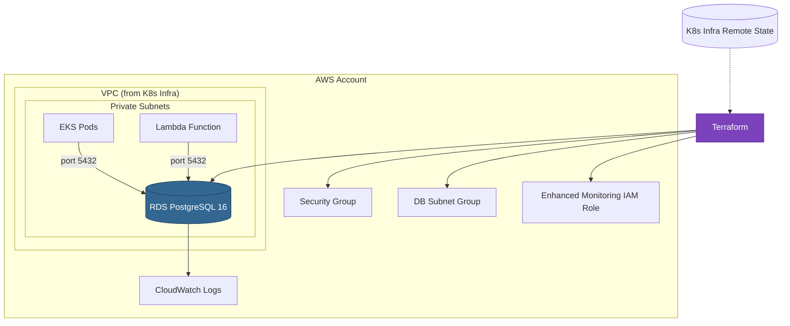
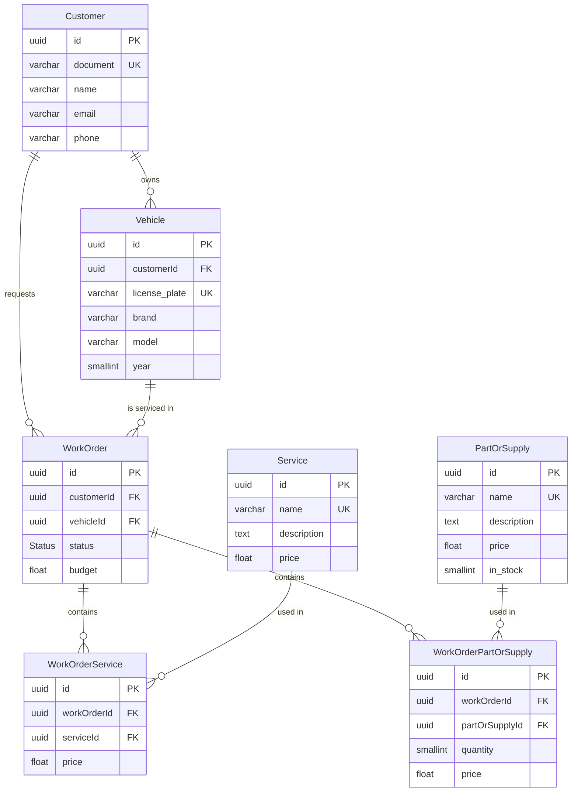

# Auto Repair Shop — Database Infrastructure

Terraform module for provisioning the **AWS RDS PostgreSQL 16** database used by the Auto Repair Shop application. Includes versioned SQL migrations, encryption at rest, enhanced monitoring, and Performance Insights.

> **Part of the [Auto Repair Shop](https://github.com/fiap-13soat) ecosystem.**
> Deploy order: K8s Infra → Lambda → **DB (this repo)** → App

---

## Table of Contents

- [Purpose](#purpose)
- [Architecture](#architecture)
- [Technologies](#technologies)
- [Project Structure](#project-structure)
- [Getting Started](#getting-started)
- [Database Schema](#database-schema)
- [CI/CD & Deployment](#cicd--deployment)
- [API Documentation](#api-documentation)
- [Related Repositories](#related-repositories)

---

## Purpose

This repository manages the database layer of the Auto Repair Shop system:

- **Provisions** a production-grade AWS RDS PostgreSQL 16 instance via Terraform
- **Configures** encryption at rest, automated backups, Enhanced Monitoring, and Performance Insights
- **Manages** versioned SQL migrations (Flyway naming convention)
- **Integrates** with the VPC and private subnets created by the [K8s Infrastructure](https://github.com/vctrlima/fiap-13soat-auto-repair-shop-k8s) repository via Terraform remote state
- **Security**: database accessible only from private subnets (EKS pods and Lambda)

---

## Architecture



### Cross-Stack Dependencies

This module reads VPC and subnet IDs from the K8s Infrastructure Terraform state:

```hcl
data "terraform_remote_state" "k8s_infra" {
  backend = "s3"
  config = {
    bucket = "auto-repair-shop-terraform-state"
    key    = "k8s-infrastructure/terraform.tfstate"
    region = "us-east-2"
  }
}
```

> **Important**: The K8s Infrastructure must be provisioned **before** this module.

---

## Technologies

| Technology         | Version | Purpose                                 |
| ------------------ | ------- | --------------------------------------- |
| **Terraform**      | ≥ 1.5.0 | Infrastructure as Code                  |
| **AWS RDS**        | —       | Managed PostgreSQL hosting              |
| **PostgreSQL**     | 16      | Relational database                     |
| **AWS Provider**   | ~5.0    | Terraform AWS resource management       |
| **S3**             | —       | Terraform state backend                 |
| **DynamoDB**       | —       | Terraform state locking                 |
| **GitHub Actions** | —       | CI/CD pipeline                          |
| **SQL**            | —       | Database migrations (Flyway convention) |

---

## Project Structure

```
├── terraform/
│   ├── main.tf                    # Root module + remote state reference
│   ├── variables.tf               # Input variables
│   ├── outputs.tf                 # Exported values
│   ├── modules/
│   │   └── database/              # RDS instance, SG, subnet group, monitoring
│   │       ├── main.tf
│   │       ├── variables.tf
│   │       └── outputs.tf
│   └── environments/
│       ├── staging/
│       │   └── terraform.tfvars   # Staging configuration
│       └── production/
│           └── terraform.tfvars   # Production configuration
└── migrations/
    └── V1__initial_schema.sql     # Initial database schema (9 tables, 2 enums)
```

---

## Getting Started

### Prerequisites

- Terraform ≥ 1.5.0
- AWS CLI configured with appropriate credentials
- S3 bucket: `auto-repair-shop-terraform-state`
- DynamoDB table: `auto-repair-shop-terraform-locks`
- **K8s Infrastructure already provisioned** (this module reads its VPC/subnet outputs)

### Terraform Commands

```bash
cd terraform

# Initialize
terraform init

# Plan (staging)
terraform plan -var-file=environments/staging/terraform.tfvars

# Plan (production)
terraform plan -var-file=environments/production/terraform.tfvars -out=tfplan

# Apply
terraform apply tfplan
```

### Key Outputs

| Output                       | Description               |
| ---------------------------- | ------------------------- |
| `database_host`              | RDS endpoint hostname     |
| `database_port`              | Port (5432)               |
| `database_name`              | Database name             |
| `database_endpoint`          | Full `host:port` endpoint |
| `database_security_group_id` | SG ID for ingress rules   |

### Environment Configurations

| Parameter        | Staging     | Production   |
| ---------------- | ----------- | ------------ |
| Instance class   | db.t3.small | db.t3.medium |
| Storage (GB)     | 10          | 20           |
| Max storage (GB) | 20          | 50           |
| Backup retention | 3 days      | 7 days       |
| Multi-AZ         | No          | No           |

---

## Database Schema

The initial migration (`V1__initial_schema.sql`) creates the following structure:

### Enums

- **`Status`** — Work order lifecycle: `RECEIVED`, `IN_DIAGNOSIS`, `WAITING_APPROVAL`, `IN_EXECUTION`, `FINISHED`, `DELIVERED`, `CANCELLED`

### Tables



All tables include `created_at` timestamps with appropriate indexes for query performance.

---

## CI/CD & Deployment

Deployed via GitHub Actions (`.github/workflows/cd.yml`):

| Stage          | Trigger                                                 | Approval             |
| -------------- | ------------------------------------------------------- | -------------------- |
| **Staging**    | Push to `main` (paths: `terraform/**`, `migrations/**`) | Automatic            |
| **Production** | After staging succeeds                                  | Manual approval gate |

The pipeline uses **OIDC-based AWS credential assumption** (no long-lived access keys).

---

## API Documentation

This is an infrastructure repository and does not expose APIs directly. For the full API documentation (Swagger UI), see the application repository:

> **Swagger UI**: Available at `http://localhost:3000/docs` when running the [App](https://github.com/vctrlima/fiap-13soat-auto-repair-shop-app).

---

## Related Repositories

This project is part of the **Auto Repair Shop** ecosystem. Deploy in this order:

| #   | Repository                                                                                                  | Description                                     |
| --- | ----------------------------------------------------------------------------------------------------------- | ----------------------------------------------- |
| 1   | [`fiap-13soat-auto-repair-shop-k8s`](https://github.com/vctrlima/fiap-13soat-auto-repair-shop-k8s)       | AWS infrastructure (VPC, EKS, ALB, API Gateway) |
| 2   | [`fiap-13soat-auto-repair-shop-lambda`](https://github.com/vctrlima/fiap-13soat-auto-repair-shop-lambda) | CPF authentication Lambda function              |
| 3   | **`fiap-13soat-auto-repair-shop-db`** (this repo)                                                           | Database infrastructure (RDS PostgreSQL)        |
| 4   | [`fiap-13soat-auto-repair-shop-app`](https://github.com/vctrlima/fiap-13soat-auto-repair-shop-app)       | Application API                                 |
