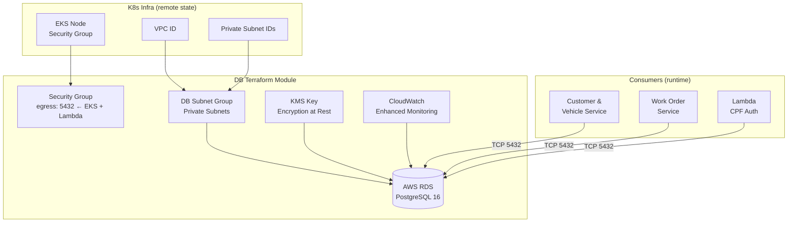
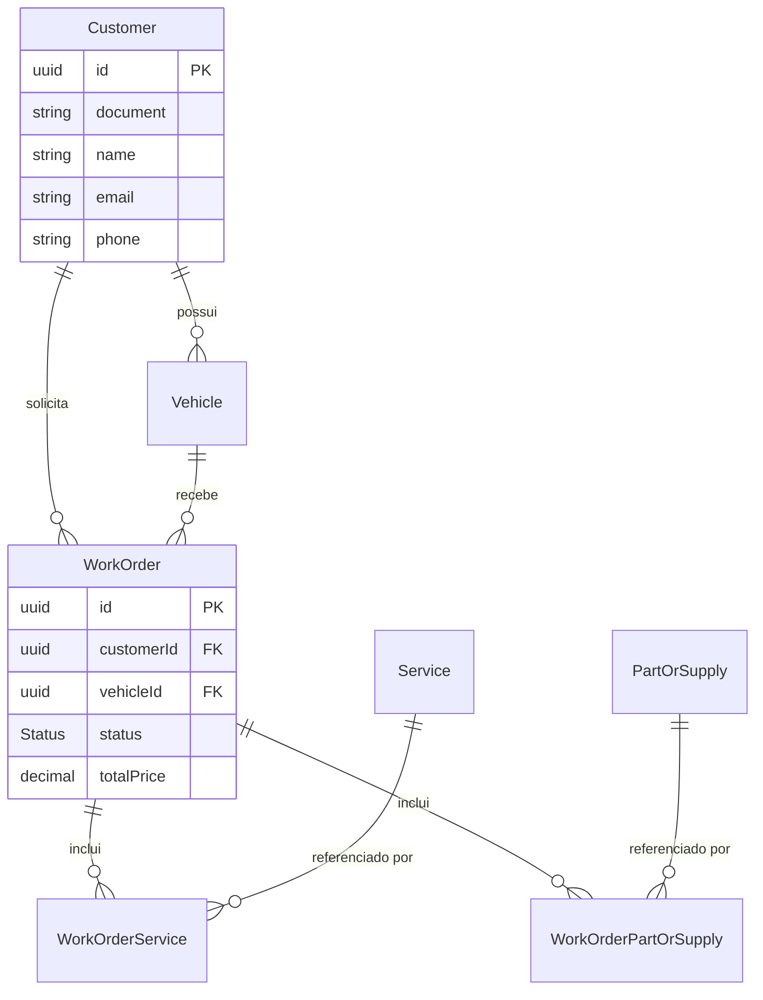

# DB Infrastructure

> Módulo Terraform que provisiona o banco de dados RDS PostgreSQL 16 da plataforma, com migrações versionadas (Flyway), criptografia em repouso, monitoramento avançado e Performance Insights.

## Sumário

- [1. Visão Geral](#1-visão-geral)
- [2. Arquitetura](#2-arquitetura)
- [3. Tecnologias Utilizadas](#3-tecnologias-utilizadas)
- [4. Comunicação entre Serviços](#4-comunicação-entre-serviços)
- [5. Diagramas](#5-diagramas)
- [6. Execução e Setup](#6-execução-e-setup)
- [7. Pontos de Atenção](#7-pontos-de-atenção)
- [8. Boas Práticas e Padrões](#8-boas-práticas-e-padrões)

---

## 1. Visão Geral

### Propósito

O repositório `db` provisiona e gerencia a camada de dados do ecossistema de oficina:

1. **RDS PostgreSQL 16** — banco de dados gerenciado com alta disponibilidade
2. **Migrações SQL** — versionadas com convenção Flyway (`V1__initial_schema.sql`)
3. **Segurança** — criptografia em repouso (KMS), subnets privadas, Security Groups restritivos
4. **Observabilidade** — Enhanced Monitoring (60s interval), Performance Insights habilitado

### Problema que Resolve

Bancos de dados provisionados manualmente são propensos a inconsistências entre ambientes. Este repositório:

- Garante reproducibilidade do schema em staging e produção
- Gerencia backups automatizados e janelas de manutenção
- Isola a infra de dados em um ciclo de deploy independente
- Mantém o schema versionado e auditável via SQL migrations

### Papel na Arquitetura

| Papel                               | Descrição                                                     |
| ----------------------------------- | ------------------------------------------------------------- |
| **Armazenamento persistente**       | PostgreSQL para Customer/Vehicle Service e Work Order Service |
| **Autenticação**                    | Banco `customer_vehicle_db` consultado pela Lambda CPF Auth   |
| **Dependente do K8s**               | Lê VPC/subnets do remote state do K8s repo                    |
| **Pré-requisito dos microserviços** | Deve existir antes do deploy das aplicações                   |

**Ordem de deploy**: K8s Infra → Lambda → **DB (este repo)** → Microserviços

---

## 2. Arquitetura

### Estrutura do Projeto

```
terraform/
├── main.tf              # Root module — chama o módulo database
├── variables.tf
├── outputs.tf
├── environments/
│   ├── staging/
│   │   └── terraform.tfvars
│   └── production/
│       └── terraform.tfvars
└── modules/
    └── database/
        ├── main.tf      # aws_db_instance, aws_db_subnet_group, aws_security_group
        ├── variables.tf
        └── outputs.tf

migrations/
└── V1__initial_schema.sql   # Schema inicial — convenção Flyway
```

### Schema do Banco

O arquivo `V1__initial_schema.sql` define todas as tabelas do domínio:

| Tabela                  | Descrição                                                                   |
| ----------------------- | --------------------------------------------------------------------------- |
| `Customer`              | Clientes (id, document/CPF, name, email, phone)                             |
| `Vehicle`               | Veículos (id, customerId, licensePlate, brand, model, year)                 |
| `Service`               | Catálogo de serviços (id, name, description, price)                         |
| `PartOrSupply`          | Catálogo de peças (id, name, description, price)                            |
| `WorkOrder`             | Ordens de serviço (id, customerId, vehicleId, status, totalPrice)           |
| `WorkOrderService`      | Relação N:N entre WorkOrder e Service                                       |
| `WorkOrderPartOrSupply` | Relação N:N entre WorkOrder e PartOrSupply                                  |
| `Status`                | Enum: `PENDING`, `WAITING_APPROVAL`, `IN_EXECUTION`, `FINISHED`, `CANCELED` |

### Decisões Arquiteturais

| Decisão                           | Justificativa                                                     | Trade-off                                                        |
| --------------------------------- | ----------------------------------------------------------------- | ---------------------------------------------------------------- |
| **RDS Managed** (vs self-managed) | AWS gerencia patches, backups, failover                           | Menos controle sobre configurações avançadas do PostgreSQL       |
| **Flyway naming convention**      | Schema versionado e auditável; fácil rollback                     | Requer disciplina de equipe para nomear migrations corretamente  |
| **Subnets privadas**              | Banco não exposto publicamente; acesso somente via Security Group | Requer VPN ou bastion host para acesso direto de desenvolvimento |
| **Single-AZ em staging**          | Custo reduzido para ambiente de testes                            | Sem failover automático; downtime em manutenção                  |
| **Multi-AZ em produção**          | Alta disponibilidade com failover automático                      | Custo ~2x maior que single-AZ                                    |

---

## 3. Tecnologias Utilizadas

| Tecnologia             | Versão | Propósito                                   |
| ---------------------- | ------ | ------------------------------------------- |
| **Terraform**          | ≥ 1.9  | IaC — provisão do RDS                       |
| **AWS RDS PostgreSQL** | 16     | Banco de dados relacional gerenciado        |
| **AWS KMS**            | —      | Criptografia em repouso                     |
| **AWS CloudWatch**     | —      | Enhanced Monitoring (métricas de SO do RDS) |
| **Flyway (convenção)** | —      | Versionamento de migrações SQL              |

**Ambientes:**
| Parâmetro | Staging | Production |
|---|---|---|
| Instance class | `db.t3.small` | `db.t3.medium` |
| Storage | 10 GB | 20 GB |
| Multi-AZ | Não | Sim |
| Backup retention | 3 dias | 7 dias |

---

## 4. Comunicação entre Serviços

### Remote State Consumido

| Repositório                        | Output Consumido     | Uso             |
| ---------------------------------- | -------------------- | --------------- |
| `fiap-13soat-auto-repair-shop-k8s` | `vpc_id`             | DB Subnet Group |
| `fiap-13soat-auto-repair-shop-k8s` | `private_subnet_ids` | Subnets do RDS  |

### Outputs Expostos

| Output        | Consumidores                        |
| ------------- | ----------------------------------- |
| `db_endpoint` | Microserviços (via Secrets Manager) |
| `db_port`     | Microserviços                       |
| `db_name`     | Microserviços                       |

### Conexões Permitidas (Security Group)

| Origem                  | Porta | Protocolo |
| ----------------------- | ----- | --------- |
| EKS Node Security Group | 5432  | TCP       |
| Lambda Security Group   | 5432  | TCP       |

---

## 5. Diagramas

### Infraestrutura de Dados



### Modelo de Dados (Simplificado)



---

## 6. Execução e Setup

### Pré-requisitos

- Terraform ≥ 1.9
- AWS CLI configurado
- K8s infra deployada (remote state disponível)
- Permissões IAM: `rds:*`, `ec2:*` (VPC/SG), `kms:*`, `secretsmanager:*`

### Deploy

```bash
cd terraform

# Staging
terraform init -backend-config="environments/staging/backend.tfvars"
terraform plan -var-file="environments/staging/terraform.tfvars"
terraform apply -var-file="environments/staging/terraform.tfvars"

# Production
terraform init -backend-config="environments/production/backend.tfvars"
terraform plan -var-file="environments/production/terraform.tfvars"
terraform apply -var-file="environments/production/terraform.tfvars"
```

### Rodar Migrações

As migrações são aplicadas pelos próprios microserviços no startup via Prisma (`prisma migrate deploy`). O arquivo `V1__initial_schema.sql` documenta o estado esperado do schema e serve como referência para outras ferramentas (Flyway, DBeaver, etc.).

```bash
# Aplicar migration manualmente (via psql com VPN/bastion)
psql -h <rds-endpoint> -U postgres -d auto_repair_db \
  -f migrations/V1__initial_schema.sql
```

### Variáveis Terraform

| Variável                 | Descrição                                |
| ------------------------ | ---------------------------------------- |
| `aws_region`             | Região AWS                               |
| `environment`            | `staging` ou `production`                |
| `db_username`            | Usuário master do RDS                    |
| `db_password`            | Senha master (deve usar Secrets Manager) |
| `db_name`                | Nome do banco principal                  |
| `instance_class`         | Tipo de instância RDS                    |
| `allocated_storage`      | Tamanho do volume (GB)                   |
| `k8s_infra_state_bucket` | Bucket S3 do remote state do K8s repo    |

---

## 7. Pontos de Atenção

### Banco Compartilhado vs Banco por Serviço

Por simplicidade, **um único RDS** serve múltiplos microserviços com schemas/tabelas separados. Em um cenário de microserviços puramente independentes, cada serviço teria seu próprio banco. O trade-off aqui é custo vs isolamento — para o escopo atual, um único RDS é suficiente.

### Senha Master do RDS

A variável `db_password` nunca deve ser passada via `terraform.tfvars` em repositórios públicos. Use AWS Secrets Manager + `data "aws_secretsmanager_secret_version"` no Terraform, ou passe via variável de ambiente `TF_VAR_db_password` no CI/CD.

### Schema Migrations

As migrations SQL são aplicadas pelos microserviços no startup via `prisma migrate deploy`. Isso significa que uma migration inválida pode impedir o pod de subir. Em produção, **teste migrations em staging antes** e mantenha compatibilidade backward nos primeiros 2 deploys (Blue-Green friendly).

### Backup e Restore

O RDS realiza backups automáticos diários com janela configurável. Para restore:

```bash
aws rds restore-db-instance-to-point-in-time \
  --source-db-instance-identifier auto-repair-shop-db \
  --target-db-instance-identifier auto-repair-shop-db-restored \
  --restore-time 2024-01-15T10:00:00Z
```

### Performance Insights e Enhanced Monitoring

Habilitados por padrão. Monitore via AWS Console → RDS → Performance Insights. Métricas críticas: `DBLoad`, `ReadLatency`, `WriteLatency`, `DatabaseConnections`.

---

## 8. Boas Práticas e Padrões

### Segurança

- **Criptografia em repouso** via KMS (chave gerenciada pelo cliente)
- **Criptografia em trânsito** via SSL (`rds.force_ssl=1`)
- **Subnets privadas** — sem acesso público ao endpoint
- **Security Groups** restritivos — apenas EKS nodes e Lambda podem conectar na porta 5432
- **Senha master** via Secrets Manager — nunca em variáveis de ambiente de texto plano

### Versionamento de Schema

- Convenção Flyway: `V{versão}__{descrição}.sql` (ex.: `V2__add_saga_tables.sql`)
- Migrações são cumulativas e nunca reversão de dados — scripts de reversão separados
- Toda migration commitada deve ser testada em staging antes da produção

### Observabilidade

- **Enhanced Monitoring** — métricas de SO (CPU, memória, I/O) com granularidade de 60s
- **Performance Insights** — rastreia top SQLs por carga de banco
- **CloudWatch Alarms** recomendados: `FreeStorageSpace < 2GB`, `DatabaseConnections > 80%`, `CPUUtilization > 80%`

### Gestão de Estado Terraform

- State remoto em S3 com locking via DynamoDB
- Workspaces separados por ambiente
- `.terraform.lock.hcl` commitado para reproducibilidade de providers
