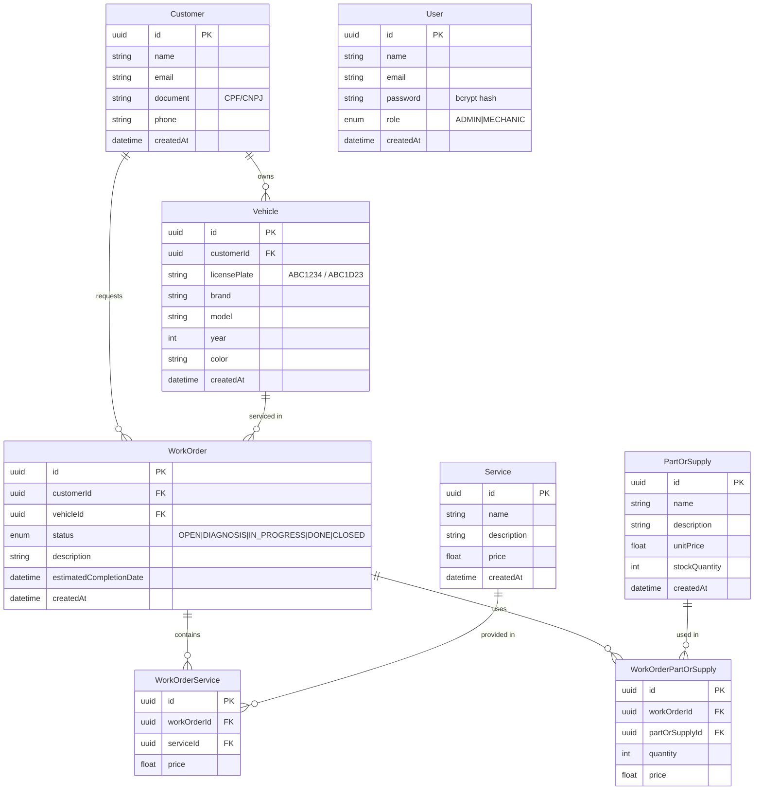

# RFC-003: Escolha do Banco de Dados e Estratégia de Dados

## Metadados

| Campo         | Valor                   |
| ------------- | ----------------------- |
| **Autor**     | Equipe Auto Repair Shop |
| **Data**      | 2026-01-12              |
| **Status**    | Aprovado                |
| **Revisores** | Equipe de Arquitetura   |

## Resumo

Esta RFC documenta a decisão sobre o banco de dados para o sistema Auto Repair Shop, incluindo justificativa técnica, modelo relacional, estratégia de migrations e configuração do serviço gerenciado.

## Motivação

O sistema gerencia dados de clientes, veículos e ordens de serviço com relacionamentos complexos e necessidade de consistência transacional. A escolha do banco impacta performance, custo operacional e complexidade de manutenção.

## Proposta Detalhada

### Análise de Requisitos de Dados

| Requisito                                             | Implicação                            |
| ----------------------------------------------------- | ------------------------------------- |
| Relacionamentos N:N (OS ↔ Serviço, OS ↔ Peça)         | Banco relacional com JOINs            |
| Transações multi-tabela (criar OS + serviços + peças) | ACID compliance                       |
| Queries agregadas (relatórios, métricas por status)   | SQL avançado (CTEs, window functions) |
| Auditoria (timestamps)                                | Campos de data em todas as tabelas    |
| Volume esperado: ~1000 OS/mês                         | Não requer sharding/distribuição      |

### Decisão: PostgreSQL 16 em AWS RDS

Escolhemos PostgreSQL 16 pelos motivos detalhados no [ADR-001: Escolha do PostgreSQL](../adrs/ADR-001-escolha-postgresql.md).

### Modelo Relacional

### Estratégia de Migrations

| Aspecto          | Decisão                                                 |
| ---------------- | ------------------------------------------------------- |
| **Ferramenta**   | Prisma Migrate (aplicação) + SQL nativo (bootstrap)     |
| **Nomenclatura** | `V{N}__{description}.sql` (Flyway-compatible)           |
| **Execução**     | Aplicada no Docker entrypoint (`prisma migrate deploy`) |
| **Rollback**     | Manual (scripts SQL reversos)                           |
| **Seed**         | Seed de produção cria admin padrão na primeira execução |

### Configuração RDS

| Setting              | Staging     | Production  |
| -------------------- | ----------- | ----------- |
| Instância            | db.t3.micro | db.t3.small |
| Storage              | 20GB gp3    | 50GB gp3    |
| Backup retention     | 7 dias      | 14 dias     |
| Multi-AZ             | Não         | Recomendado |
| Encryption           | Sim (KMS)   | Sim (KMS)   |
| Enhanced Monitoring  | 60s         | 60s         |
| Performance Insights | Sim         | Sim         |
| Deletion Protection  | Não         | Sim         |

### Segurança

- **Rede**: RDS em subnets privadas, acessível apenas por Security Group que permite ingress da VPC
- **Credenciais**: Armazenadas no AWS Secrets Manager, sincronizadas para K8s via ExternalSecrets
- **Encryption at rest**: AES-256 via KMS
- **Encryption in transit**: SSL/TLS obrigatório
- **Logs**: PostgreSQL logs exportados para CloudWatch

## Impacto

- **Consistência**: ACID garante integridade transacional
- **Observabilidade**: Performance Insights e Enhanced Monitoring sem overhead
- **Segurança**: Dados isolados em VPC, criptografados em repouso e trânsito
- **Custo**: RDS db.t3.micro (staging) ~$15/mês; db.t3.small (prod) ~$30/mês

## Decisão

Aprovado. PostgreSQL 16 em RDS implementado conforme especificado, com infraestrutura provisionada via Terraform no repositório `fiap-13soat-auto-repair-shop-db`.
